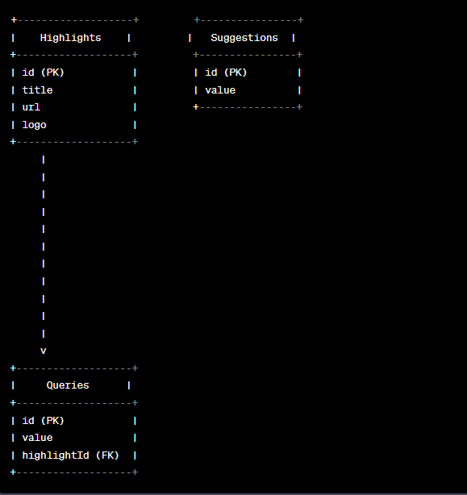
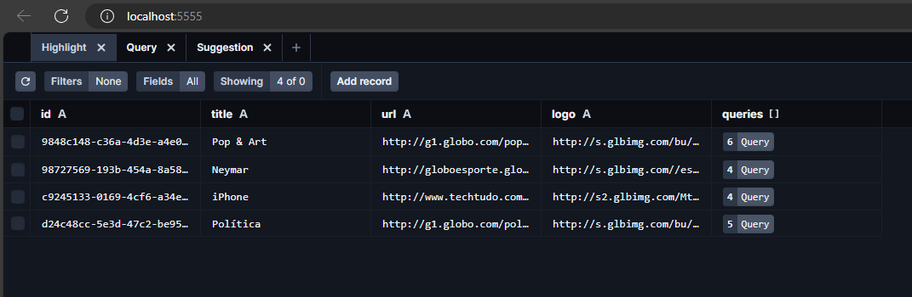
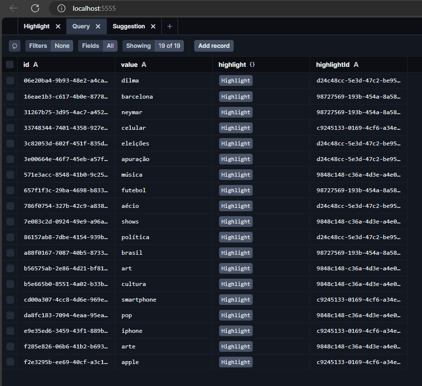
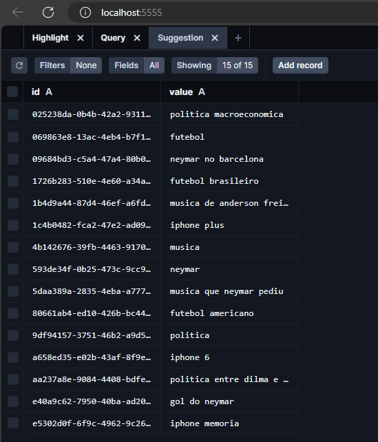

<h3 align="center">
    <b>API do Live Search</b>
</h3>

# Índice

- [Sobre](#sobre)
- [Tecnologias Utilizadas](#tecnologias-utilizadas)
- [Como Usar](#como-usar)
- [Como Contribuir](#como-contribuir)

## :bookmark: Sobre

<strong>API do Live Search, contem 2 array de objetos que listam dados de highlights e suggestions</strong>

## :heavy_check_mark: :iphone: Tablet Banco de Dados

# Diagrama Entidade e Relacionamento

<h1 align="center">
    
</h1>

# Highlights

<h1 align="center">
    
</h1>

# Queries

<h1 align="center">
    
</h1>

# Suggestions

<h1 align="center">
    
</h1>

### Requisitos

- [x] Servidor feito com Nodejs
- [x] banco utilizado o postgresql
- [x] Deve ser utilizado o Docker
- [x] Deve conter uma rota para lista suggestions
- [x] Deve conter uma rota para lista highlights
- [x] Deve ter uma tabela de Highlights
- [x] Deve ter uma tabela de queries
- [x] Deve ter uma tabela de Suggestions

<a id="tecnologias-utilizadas"></a>

## :rocket: Tecnologias Utilizadas

O projeto foi desenvolvido utilizando as seguintes tecnologias

- [Typescript](https://www.typescriptlang.org/docs/handbook/typescript-in-5-minutes.html)
- [Node.js](https://nodejs.org/en/docs)
- [Prisma](https://www.prisma.io/docs)
- [Docker]("")

<a id="como-usar"></a>

## :fire: Como usar

1. Faça um clone :

```sh
  $ git clone https://github.com/SelecaoGlobocom/rafael-rufino.git
```

2. Executando a Aplicação:

```sh
  # Instale as dependências
  $ npm install
  ou
  $ Yarn

  # Inicie a aplicação web
  $ cd api
  $ yarn dev
  ou
  $ npm run dev

 # Passo 3: Crie o Container Docker para a aplicação:

 $ docker-compose up -d

 # Passo 4: Se desejar preencher o banco de dados com dados de teste ou iniciais, execute o seguinte comando de seed:
$ yarn prisma db seed


```

<a id="como-contribuir"></a>

# :recycle: Como contribuir

- Faça um Fork desse repositório,
- Crie uma branch com a sua feature: `git checkout -b my-feature`
- Commit suas mudanças: `git commit -m 'feat: My new feature'`
- Push a sua branch: `git push origin my-feature`

## :memo: License

Esse projeto está sob a licença MIT. Veja o arquivo [LICENSE](LICENSE.md) para mais detalhes.

---

<h4 align="center">
    Feito com 💜 by <a href="https://www.linkedin.com/in/rafael-r-dos-santos/" target="_blank">Rafael Rufino</a>
</h4>
