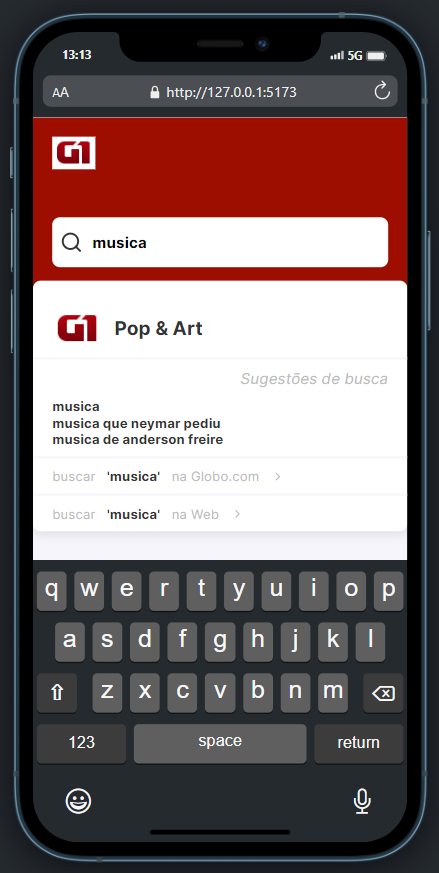

<h3 align="center">
    <b>Live Search WEB</b>
</h3>

# Índice

- [Sobre](#sobre)
- [Tecnologias Utilizadas](#tecnologias-utilizadas)
- [Como Usar](#como-usar)
- [Como Contribuir](#como-contribuir)

## :bookmark: Sobre

<strong>Live Search é uma aplicação de busca por palavras chave que tem na API</strong>

## :heavy_check_mark: :iphone: Versão Web

<h1 align="center">
    
    
</h1>

### Requisitos

- [x] interface construida com React, typescript e Styled-components

- [x] incluir as cores e fonts da interface

- [x] Integração entre front-end e backend

- [x] A página deve ser responsiva;

- [x] O live search deve ser atualizado conforme o usuário digita o termo de busca no campo de texto;

- [x] A busca deve ignorar a diferença entre letras maiúsculas/minúsculas (case insensitive) e acentos;

- [x] Caso algum item da seção "highlights" no JSON de resultado seja compatível com a busca do usuário através da chave "queries", o mesmo deve ser exibido como no exemplo "Pop & Arte" acima, com a logo, e clicável para sua URL

- [x] Caso algum termo da seção "suggestions" seja compatível com a busca, o mesmo deve aparecer como "Sugestões de busca", com um link para http://g1.globo.com/busca/?q=<TERMO PESQUISADO>;

- [x] (Opcional, bônus) Diferenciar os caracteres que deram match no resultado do live search aplicando negrito.

- [x] (Opcional, bônus) As teclas (→, ←) preenchem ou removem, respectivamente, o termo com o termo sugerido. Por exemplo: Digitou fla e usuário apertou →, então preenche com flamengo. Se após completar com flamengo, o usuário apertar ←, volta para o termo fla.

- [x] testes automatizados

<a id="tecnologias-utilizadas"></a>

## :rocket: Tecnologias Utilizadas

O projeto foi desenvolvido utilizando as seguintes tecnologias

- [React](https://react.dev/)
- [Typescript](https://www.typescriptlang.org/docs/handbook/typescript-in-5-minutes.html)
- [Styled-components](https://styled-components.com/)

<a id="como-usar"></a>

## :fire: Como usar

1. Faça um clone :

```sh
  $ git clone https://github.com/SelecaoGlobocom/rafael-rufino.git
```

2. Executando a Aplicação:

```sh
  # Instale as dependências
  $ npm install
  ou
  $ Yarn

  # Inicie a aplicação web
  $ cd web
  $ yarn dev
  ou
  $ npm run dev

```

3. Executando os testes:

```sh
  # rodando os testes
  $ yarn test
  ou
  $ npm run test
```

<a id="como-contribuir"></a>

# :recycle: Como contribuir

- Faça um Fork desse repositório,
- Crie uma branch com a sua feature: `git checkout -b my-feature`
- Commit suas mudanças: `git commit -m 'feat: My new feature'`
- Push a sua branch: `git push origin my-feature`

## :memo: License

Esse projeto está sob a licença MIT. Veja o arquivo [LICENSE](LICENSE.md) para mais detalhes.

---

<h4 align="center">
    Feito com 💜 by <a href="https://www.linkedin.com/in/rafael-r-dos-santos/" target="_blank">Rafael Rufino</a>
</h4>
